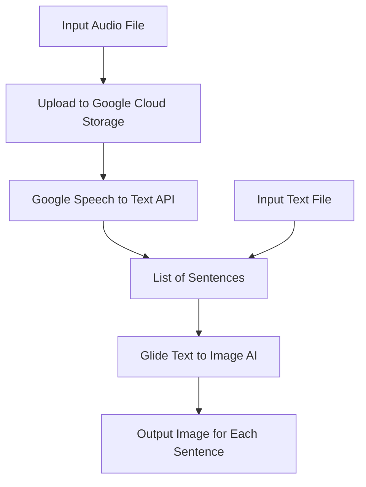

# This repository is for Synopsys's 2022 Science Fair.

## It is code for a program that converts english audio or text to images corresponding with that text using Google Cloud's Speech-to-Text API and OpenAI's Glide Text to Image AI. It can help to augment written or spoken communication.

